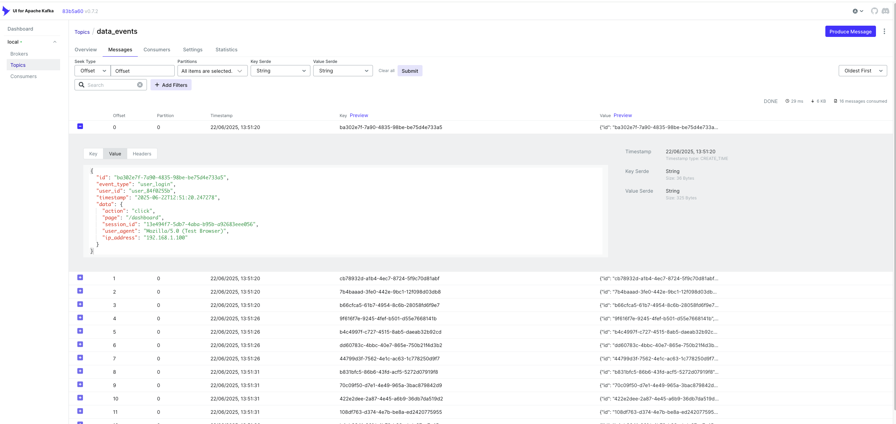

# ETL Kafka-Streaming Stack Setup

This Docker Compose stack provides a complete ETL pipeline with Kafka and PostgreSQL for processing streaming data.

## Architecture

- **Kafka**: Message broker for streaming data
- **Zookeeper**: Kafka coordination service
- **PostgreSQL**: Database for storing processed data
- **ETL Consumer**: Python service using confluent-kafka to process messages
- **Kafka UI**: Web interface for monitoring Kafka (optional)
- **Sample Producer**: Python script to produce test messages to Kafka


## Directory Structure

```
kafka-streaming/
.
├── docker-compose.yml
├── etl-service
│   ├── consumer.py
│   ├── Dockerfile
│   └── requirements.txt
├── init-db.sql
├── README.md
└── test_producer.py

2 directories, 7 files

```

## Quick Start

1. **Start the stack:**
   ```bash
   docker-compose up -d
   ```

2. **Check if services are running:**
   ```bash
   docker-compose ps
   ```

3. **View logs:**
   ```bash
   docker-compose logs -f etl-consumer
   ```

## Testing the Pipeline

1. **Install required python packages locally** (for the sample producer):
   ```bash
   pip install -r etl-service/requirements.txt
   ```

2. **Run the sample producer:**
   ```bash
   python test_producer.py
   ```

Example output:
```bash
python test_producer.py                    
Starting sample producer...
Press Ctrl+C to stop

Sent event: user_login - ba302e7f-7a90-4835-98be-be75d4e733a5
Sent event: page_view - cb78932d-a1b4-4ec7-8724-5f9c70d81abf
Sent event: user_action - 7b4baaad-3fe0-442e-9bc1-12f098d03db8
Sent event: purchase - b66cfca5-61b7-4954-8c6b-28058fd6f9e7
Message delivered to data_events [0]
Message delivered to data_events [0]
Message delivered to data_events [0]
Message delivered to data_events [0]
Sent event: user_login - 9f616f7e-9245-4fef-b501-d55e7668141b
Sent event: page_view - b4c4997f-c727-4515-8ab5-daeab32b92cd
Sent event: user_action - dd60783c-4bbc-40e7-865e-750b21f4d3b2
Sent event: purchase - 44799d3f-7562-4e1c-ac63-1c778250d9f7
Message delivered to data_events [0]
Message delivered to data_events [0]
Message delivered to data_events [0]
Message delivered to data_events [0]
Sent event: user_login - b831bfc5-86b6-43fd-acf5-5272d07919f8
Sent event: page_view - 70c09f50-d7e1-4e49-965a-3bac879842d9
Sent event: user_action - 422e2dee-2a87-4e45-a6b9-36db7da519d2
```


3. **View ETL consumer logs** to see processing details:
   ```bash
   docker-compose logs -f etl-consumer
   ```
   
```bash
etl-consumer  | 2025-06-22 12:51:31,330 - __main__ - INFO - Processed message: 70c09f50-d7e1-4e49-965a-3bac879842d9
etl-consumer  | 2025-06-22 12:51:31,334 - __main__ - INFO - Saved record to database: 70c09f50-d7e1-4e49-965a-3bac879842d9
etl-consumer  | 2025-06-22 12:51:31,334 - __main__ - INFO - Received message: {'id': '422e2dee-2a87-4e45-a6b9-36db7da519d2', 'event_type': 'user_action', 'user_id': 'user_70c8ad2d', 'timestamp': '2025-06-22T12:51:31.316765', 'data': {'action': 'click', 'page': '/dashboard', 'session_id': '2c7fa720-a7f5-4d54-9b03-11839b0b417e', 'user_agent': 'Mozilla/5.0 (Test Browser)', 'ip_address': '192.168.1.100'}}
etl-consumer  | 2025-06-22 12:51:31,334 - __main__ - INFO - Processed message: 422e2dee-2a87-4e45-a6b9-36db7da519d2
etl-consumer  | 2025-06-22 12:51:31,337 - __main__ - INFO - Saved record to database: 422e2dee-2a87-4e45-a6b9-36db7da519d2
etl-consumer  | 2025-06-22 12:51:31,337 - __main__ - INFO - Received message: {'id': '108df763-d374-4e7b-be8a-ed2420775955', 'event_type': 'purchase', 'user_id': 'user_91789f93', 'timestamp': '2025-06-22T12:51:31.316802', 'data': {'action': 'click', 'page': '/dashboard', 'session_id': '237f8aba-9f47-4206-aed4-c0002263c695', 'user_agent': 'Mozilla/5.0 (Test Browser)', 'ip_address': '192.168.1.100'}}
etl-consumer  | 2025-06-22 12:51:31,337 - __main__ - INFO - Processed message: 108df763-d374-4e7b-be8a-ed2420775955
etl-consumer  | 2025-06-22 12:51:31,339 - __main__ - INFO - Saved record to database: 108df763-d374-4e7b-be8a-ed2420775955
etl-consumer  | 2025-06-22 12:51:36,340 - __main__ - INFO - Received message: {'id': 'b4cb9341-36fd-4b78-b93a-bde97ea7c45e', 'event_type': 'user_login', 'user_id': 'user_5a3ad21a', 'timestamp': '2025-06-22T12:51:36.328495', 'data': {'action': 'click', 'page': '/dashboard', 'session_id': 'd80e52be-a539-4cbc-9bb8-e2ded5a0a4cf', 'user_agent': 'Mozilla/5.0 (Test Browser)', 'ip_address': '192.168.1.100'}}
etl-consumer  | 2025-06-22 12:51:36,341 - __main__ - INFO - Processed message: b4cb9341-36fd-4b78-b93a-bde97ea7c45e
etl-consumer  | 2025-06-22 12:51:36,345 - __main__ - INFO - Saved record to database: b4cb9341-36fd-4b78-b93a-bde97ea7c45e
etl-consumer  | 2025-06-22 12:51:36,345 - __main__ - INFO - Received message: {'id': '57f18b0d-865f-492e-8d1e-f36e0176fe37', 'event_type': 'page_view', 'user_id': 'user_4335e9f9', 'timestamp': '2025-06-22T12:51:36.328557', 'data': {'action': 'click', 'page': '/dashboard', 'session_id': '93c2adc9-4795-4814-8079-136635086ce5', 'user_agent': 'Mozilla/5.0 (Test Browser)', 'ip_address': '192.168.1.100'}}
etl-consumer  | 2025-06-22 12:51:36,345 - __main__ - INFO - Processed message: 57f18b0d-865f-492e-8d1e-f36e0176fe37
etl-consumer  | 2025-06-22 12:51:36,348 - __main__ - INFO - Saved record to database: 57f18b0d-865f-492e-8d1e-f36e0176fe37
etl-consumer  | 2025-06-22 12:51:36,348 - __main__ - INFO - Received message: {'id': '96682d4a-23f3-494f-be98-8e980b995092', 'event_type': 'user_action', 'user_id': 'user_f51ac288', 'timestamp': '2025-06-22T12:51:36.328591', 'data': {'action': 'click', 'page': '/dashboard', 'session_id': 'a4c477d8-b141-4586-bc05-bab46e262f85', 'user_agent': 'Mozilla/5.0 (Test Browser)', 'ip_address': '192.168.1.100'}}
etl-consumer  | 2025-06-22 12:51:36,348 - __main__ - INFO - Processed message: 96682d4a-23f3-494f-be98-8e980b995092
etl-consumer  | 2025-06-22 12:51:36,350 - __main__ - INFO - Saved record to database: 96682d4a-23f3-494f-be98-8e980b995092
etl-consumer  | 2025-06-22 12:51:36,351 - __main__ - INFO - Received message: {'id': 'f68bb237-35fa-4cc9-9cc7-fda90c570a0b', 'event_type': 'purchase', 'user_id': 'user_0fbec0e0', 'timestamp': '2025-06-22T12:51:36.328625', 'data': {'action': 'click', 'page': '/dashboard', 'session_id': '918e243a-6679-4b47-aa88-91ff32b9f14d', 'user_agent': 'Mozilla/5.0 (Test Browser)', 'ip_address': '192.168.1.100'}}
etl-consumer  | 2025-06-22 12:51:36,351 - __main__ - INFO - Processed message: f68bb237-35fa-4cc9-9cc7-fda90c570a0b
etl-consumer  | 2025-06-22 12:51:36,353 - __main__ - INFO - Saved record to database: f68bb237-35fa-4cc9-9cc7-fda90c570a0b

```

4. **Check the database** for processed data:
   ```bash
   docker exec -it etl-postgres psql -U etl_user -d etl_db -c "SELECT * FROM events LIMIT 10;"
   ```

```bash
docker exec -it etl-postgres psql -U etl_user -d etl_db -c "SELECT * FROM events LIMIT 10;"

                  id                  | event_type  |    user_id    |           timestamp           |                                                                                    data                                                                                    |         processed_at          |          created_at           
--------------------------------------+-------------+---------------+-------------------------------+----------------------------------------------------------------------------------------------------------------------------------------------------------------------------+-------------------------------+-------------------------------
 8e7bd28d-9cd4-4d12-bd01-7f4c3018ea5c | user_login  | user_d85ec737 | 2025-06-13 23:12:15.320017+00 | {"page": "/dashboard", "action": "click", "ip_address": "192.168.1.100", "session_id": "4af5959a-f13b-4706-bcab-88e4ca3c0644", "user_agent": "Mozilla/5.0 (Test Browser)"} | 2025-06-13 23:12:16.339362+00 | 2025-06-13 23:12:16.351948+00
 fff4f06a-84fe-44ac-9d5b-db29d6f945fe | page_view   | user_ff4a7495 | 2025-06-13 23:12:15.320345+00 | {"page": "/dashboard", "action": "click", "ip_address": "192.168.1.100", "session_id": "4b548148-6415-4bc3-a25b-acc6d85122b1", "user_agent": "Mozilla/5.0 (Test Browser)"} | 2025-06-13 23:12:16.35333+00  | 2025-06-13 23:12:16.353506+00
 69c2599b-55d1-4fb5-ae76-76531c5afb30 | user_action | user_4a640263 | 2025-06-13 23:12:15.320355+00 | {"page": "/dashboard", "action": "click", "ip_address": "192.168.1.100", "session_id": "1e514845-f508-4ffa-b486-5d114524dc0b", "user_agent": "Mozilla/5.0 (Test Browser)"} | 2025-06-13 23:12:16.353992+00 | 2025-06-13 23:12:16.354123+00
 367e845a-0cbb-49e8-84f8-986686659ad7 | purchase    | user_c80393fa | 2025-06-13 23:12:15.320363+00 | {"page": "/dashboard", "action": "click", "ip_address": "192.168.1.100", "session_id": "07730dd6-f08c-4d6d-9720-f0136bbea92c", "user_agent": "Mozilla/5.0 (Test Browser)"} | 2025-06-13 23:12:16.354539+00 | 2025-06-13 23:12:16.354677+00
 f75828d7-d174-404f-b3eb-86d532f27eeb | user_login  | user_c37bdd97 | 2025-06-13 23:12:21.33406+00  | {"page": "/dashboard", "action": "click", "ip_address": "192.168.1.100", "session_id": "ecda9235-dfce-438f-b46c-a7b8d000bf6b", "user_agent": "Mozilla/5.0 (Test Browser)"} | 2025-06-13 23:12:21.33949+00  | 2025-06-13 23:12:21.340155+00
 d4b954d1-32d4-4194-ab79-b4b3f1765a3b | page_view   | user_a9cecd02 | 2025-06-13 23:12:21.334116+00 | {"page": "/dashboard", "action": "click", "ip_address": "192.168.1.100", "session_id": "28c299c7-bbfa-40f8-9cea-cd65f4a36cfb", "user_agent": "Mozilla/5.0 (Test Browser)"} | 2025-06-13 23:12:21.341866+00 | 2025-06-13 23:12:21.342323+00
 df7c29fc-d188-4cf2-881f-d95e2b908a7f | user_action | user_4323d427 | 2025-06-13 23:12:21.334138+00 | {"page": "/dashboard", "action": "click", "ip_address": "192.168.1.100", "session_id": "398ffc36-559b-4964-96c3-5c95a0b75642", "user_agent": "Mozilla/5.0 (Test Browser)"} | 2025-06-13 23:12:21.344207+00 | 2025-06-13 23:12:21.34463+00
 b8775b54-a167-4c78-8700-222d380af438 | purchase    | user_58b48668 | 2025-06-13 23:12:21.334156+00 | {"page": "/dashboard", "action": "click", "ip_address": "192.168.1.100", "session_id": "7d534e84-c670-4ae4-9919-867117f7aa71", "user_agent": "Mozilla/5.0 (Test Browser)"} | 2025-06-13 23:12:21.346469+00 | 2025-06-13 23:12:21.346858+00
 891751a5-1034-423f-9900-83d0784d8349 | user_login  | user_7df8952c | 2025-06-13 23:12:26.343476+00 | {"page": "/dashboard", "action": "click", "ip_address": "192.168.1.100", "session_id": "411f0de3-cf9b-429a-92c7-6abeee9675d2", "user_agent": "Mozilla/5.0 (Test Browser)"} | 2025-06-13 23:12:26.352115+00 | 2025-06-13 23:12:26.353206+00
 045c769a-58e1-41be-870d-55cd98888057 | page_view   | user_568bab66 | 2025-06-13 23:12:26.343593+00 | {"page": "/dashboard", "action": "click", "ip_address": "192.168.1.100", "session_id": "5dcf2bef-812f-4d06-a79c-f6f2a61b66e6", "user_agent": "Mozilla/5.0 (Test Browser)"} | 2025-06-13 23:12:26.356483+00 | 2025-06-13 23:12:26.357089+00
(10 rows)

```


## Monitoring

- **Kafka UI**: http://localhost:8080



- **PostgreSQL**: localhost:5432
  - Database: `etl_db`
  - User: `etl_user`
  - Password: `etl_password`

## Configuration

### Environment Variables

The ETL consumer can be configured using these environment variables:

- `KAFKA_BOOTSTRAP_SERVERS`: Kafka broker address
- `KAFKA_TOPIC`: Topic to consume from
- `KAFKA_GROUP_ID`: Consumer group ID
- `DB_HOST`: PostgreSQL host
- `DB_PORT`: PostgreSQL port
- `DB_NAME`: Database name
- `DB_USER`: Database user
- `DB_PASSWORD`: Database password

### Customizing the ETL Logic

Modify the `process_message()` method in `etl-service/consumer.py` to implement your specific data transformation logic.

## Database Schema

The stack creates these tables:

- `events`: Main table for processed events
- `raw_events`: Backup table for raw message data
- `event_summary`: View for analytics

## Troubleshooting

1. **"events" table doesn't exist**: The init script didn't run. Try:
   ```bash
   # Check if init-db.sql is in the right location
   ls -la init-db.sql
   
   # Recreate the database container
   docker-compose down
   docker volume rm etl-kafka-stack_postgres_data
   docker-compose up -d postgres
   
   # Or manually create the table
   docker exec -it etl-postgres psql -U etl_user -d etl_db -f /docker-entrypoint-initdb.d/init-db.sql
   ```

2. **Services not starting**: Check Docker logs
   ```bash
   docker-compose logs [service-name]
   ```

3. **Connection issues**: Ensure all services are healthy
   ```bash
   docker-compose ps
   ```

4. **Database connection**: Verify PostgreSQL is accessible
   ```bash
   docker exec -it etl-postgres pg_isready
   ```

5. **Check database initialization**:
   ```bash
   # List tables in the database
   docker exec -it etl-postgres psql -U etl_user -d etl_db -c "\dt"
   
   # Check if init script exists in container
   docker exec -it etl-postgres ls -la /docker-entrypoint-initdb.d/
   ```

## Scaling

To scale the ETL consumer:
```bash
docker-compose up -d --scale etl-consumer=3
```

## Stopping the Stack

```bash
docker-compose down -v  # -v removes volumes
```