# ETL Pipeline with Airflow, Postgres, GCS, and BigQuery

This project demonstrates how to set up an ETL pipeline using Apache Airflow, Postgres, Google Cloud Storage (GCS),
and BigQuery.
## Description

### Overview
This project is designed to demonstrate how to create an ETL pipeline using Apache Airflow. 
 The pipeline extracts employee data from a CSV file, loads it into Postgres, and then transfers it to BigQuery.

### Dataset
The dataset used in this project is a CSV file containing employee data.
The URL for the dataset is [here](https://raw.githubusercontent.com/apache/airflow/main/airflow-core/docs/tutorial/pipeline_example.csv).

### Tools & Technologies

- Cloud - [**Google Cloud Platform**](https://cloud.google.com)
- Containerization - [**Docker**](https://www.docker.com), [**Docker Compose**](https://docs.docker.com/compose/)
- Orchestration - [**Airflow**](https://airflow.apache.org)
- Data Lake - [**Google Cloud Storage**](https://cloud.google.com/storage)
- Data Warehouse - [**BigQuery**](https://cloud.google.com/bigquery)
- Language - [**Python**](https://www.python.org)

### Architecture Overview

- Data Source: GitHub repository as the external CSV data source
- Orchestration: Apache Airflow for managing the ETL pipeline
- Database: Postgres for staging data
- Data Lake: Google Cloud Storage (GCS) for storing raw data
- Data Warehouse: Google BigQuery for structured data storage

```mermaid
graph TB
    %% Data Source
    GITHUB["🌐 GitHub Repository<br/>📄 CSV Data Source"]
    
    %% Orchestration Layer
    subgraph AIRFLOW_BOX ["⚡ APACHE AIRFLOW"]
        SCHEDULER["⏰ Scheduler<br/>Daily Execution"]
        WORKER["🔧 Worker Nodes<br/>Task Processing"]
        
        SCHEDULER -.-> WORKER
    end
    
    %% Processing & Staging
    subgraph POSTGRES_BOX ["🐘 POSTGRESQL"]
        TEMP_TABLE["📊 Temp Table<br/>Staging"]
        MAIN_TABLE["🏛️ Production Table<br/>Final Storage"]
        
        TEMP_TABLE -->|Upsert| MAIN_TABLE
    end
    
    %% Local Storage
    subgraph LOCAL_BOX ["🗂️ LOCAL STORAGE"]
        RAW_CSV["📄 CSV Files"]
        LOCAL_PARQUET["⚡ Parquet Files"]
        
        RAW_CSV --> LOCAL_PARQUET
    end
    
    %% Data Lake
    subgraph GCS_BOX ["☁️ GOOGLE CLOUD STORAGE"]
        PARQUET["⚡ Parquet Files<br/>Columnar Format"]
    end
    
    %% Data Warehouse
    subgraph BQ_BOX ["📊 BIGQUERY"]
        EXTERNAL_TABLE["🔗 External Table"]
        DATASET["📚 Dataset"]
        
        EXTERNAL_TABLE --> DATASET
    end
    
    %% Main Data Flow
    GITHUB --> SCHEDULER
    WORKER --> RAW_CSV
    WORKER --> TEMP_TABLE
    LOCAL_PARQUET --> PARQUET
    PARQUET --> EXTERNAL_TABLE
    
    %% Styling
    classDef source fill:#e3f2fd,stroke:#1976d2,stroke-width:2px
    classDef orchestration fill:#f3e5f5,stroke:#7b1fa2,stroke-width:2px
    classDef database fill:#e8f5e8,stroke:#388e3c,stroke-width:2px
    classDef datalake fill:#e0f2f1,stroke:#00695c,stroke-width:2px
    classDef warehouse fill:#fff3e0,stroke:#f57c00,stroke-width:2px
    classDef component fill:#f5f5f5,stroke:#424242,stroke-width:1px
    
    class GITHUB source
    class AIRFLOW_BOX orchestration
    class POSTGRES_BOX database
    class GCS_BOX datalake
    class BQ_BOX warehouse
    class SCHEDULER,WORKER,TEMP_TABLE,MAIN_TABLE,RAW_CSV,LOCAL_PARQUET,PARQUET,EXTERNAL_TABLE,DATASET component
```



### DAG Graph


## 1. Setup Instructions

- Ensure you have Docker and Docker Compose installed on your machine.
- The `.env` file should contain the following environment variables:
  ```bash
  echo -e "AIRFLOW_UID=$(id -u)" > .env
  ```
- Run the following command to start the Airflow environment:
```bash
docker-compose up airflow-init
docker-compose up
```

## 2. Configure Postgres Connection
- Open the Airflow UI at `http://localhost:8080`
- Log in with the default credentials:
  - Username: `airflow`
  - Password: `airflow`
  - Note: You can change these credentials in the `docker-compose.yaml` file.
  - Go to Admin -> Connections
  - Click on "Create" to add a new connection
  - Connection ID: `tutorial_pg_conn`
  - Connection Type: `Postgres`
  - Host: `postgres`
  - Login: `airflow`
  - Password: `airflow`
  - Database: `airflow`

## 3. Configure GCP connection

### 3.1. Setup Google Cloud Service Account
1. Go to the [Google Cloud Console](https://console.cloud.google.com/).
2. Create a new project or select an existing one.
3. Navigate to "IAM & Admin" -> "Service Accounts".
4. Click on "Create Service Account".
5. Enter a name for the service account (e.g., `airflow-trang-sa`).
6. Assign the role `Owner` the tasks.
7. Click "Done" to create the service account.
8. Create a key for the service account:
   - Click on the service account you just created.
   - Go to the "Keys" tab.
   - Click "Add Key" -> "Create new key".
   - Choose JSON format and click "Create".
   - Save the downloaded JSON file securely.

### 3.2. Configure Airflow to use the GCP Service Account
- Go to Admin -> Connections
- Click on "Create" to add a new connection
- Connection ID: `gcp_trang_default`
- Connection Type: `Google Cloud`
- Keyfile JSON: Paste the content of your GCP service account JSON key file here.

## 4. Create a GCS bucket
1. Go to the [Google Cloud Console](https://console.cloud.google.com/).
2. Navigate to "Storage" -> "Browser".
3. Click on "Create bucket".
4. Enter a unique name for your bucket (e.g., `airflow-trang-bucket-2`).
5. Choose a location for your bucket.
6. Click "Create" to create the bucket.


## 5. Create a BigQuery dataset
1. Go to the [Google Cloud Console](https://console.cloud.google.com/).
2. Navigate to "BigQuery".
3. Click on your project name in the left sidebar.
4. Click on "Create Dataset".
5. Enter a name for your dataset (e.g., `airflow_trang_dataset`).
6. Choose a data location.
7. Click "Create Dataset" to create the dataset.

## 6. Run the DAG
- Open the Airflow UI at `http://localhost:8080`
- You should see the DAG `process_employees` in the list of DAGs.
- Turn on the DAG by toggling the switch next to it.
- Click on the DAG name to view its details.
- You can manually trigger the DAG by clicking on the "Trigger DAG" button.